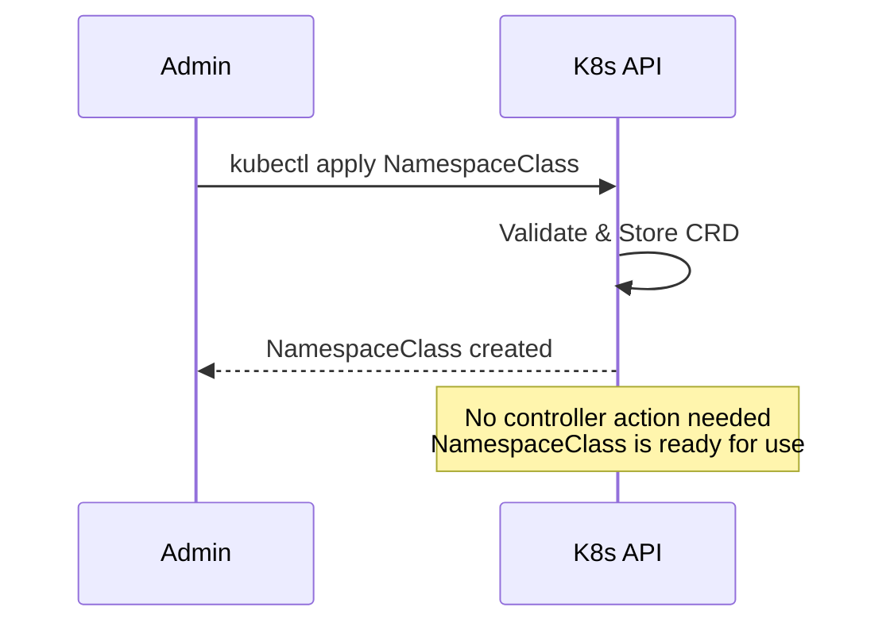
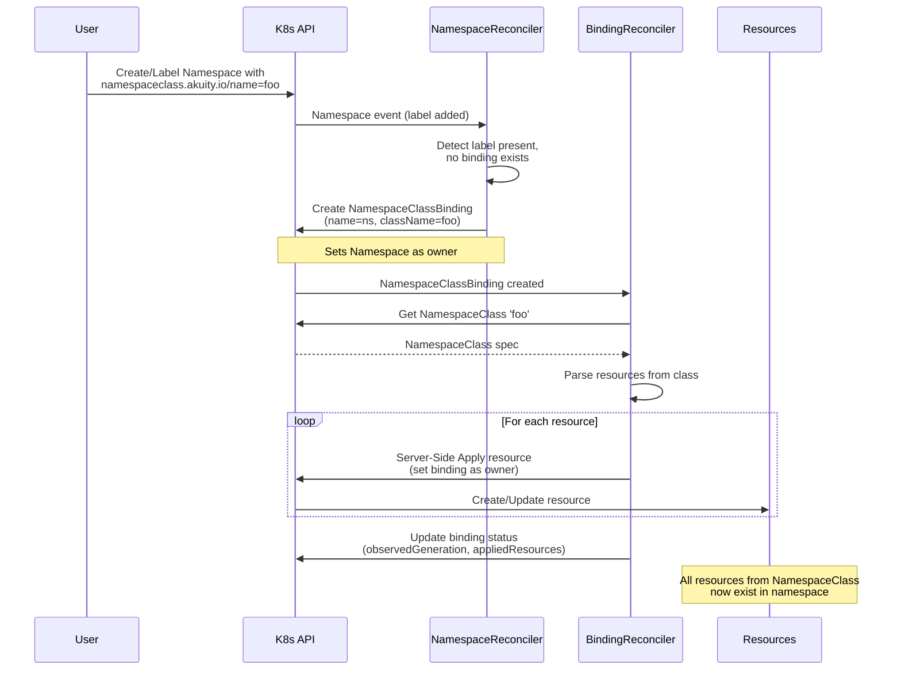
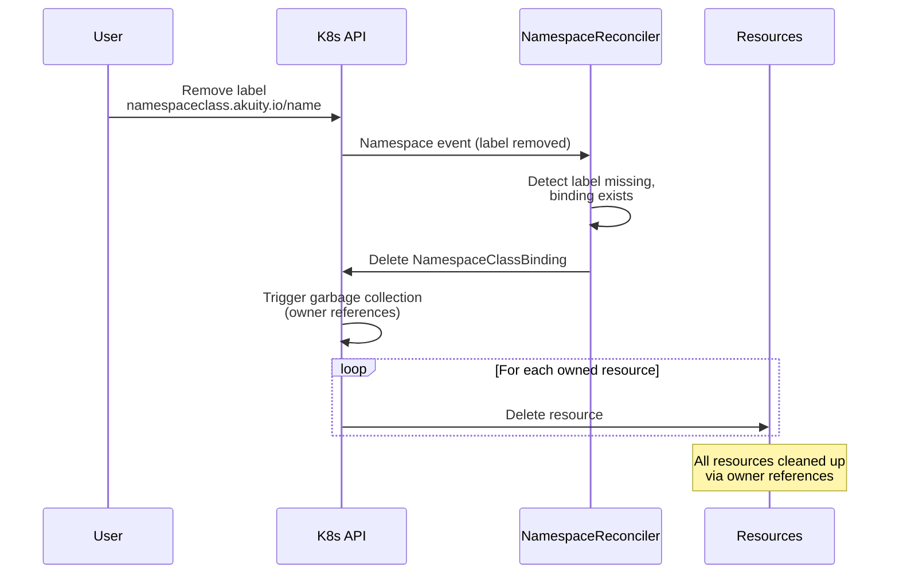
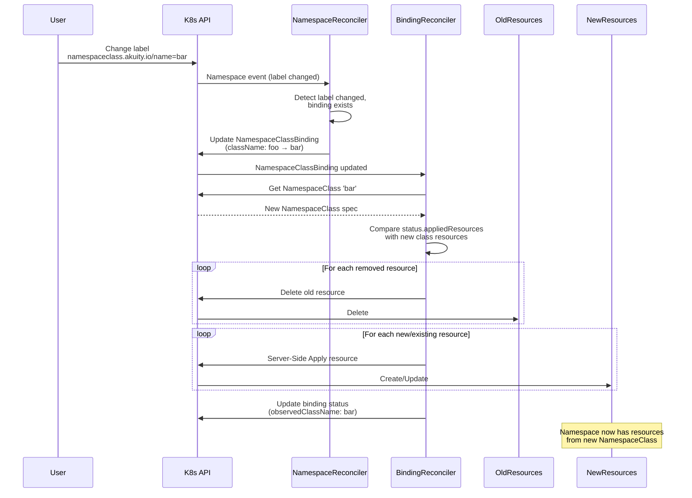
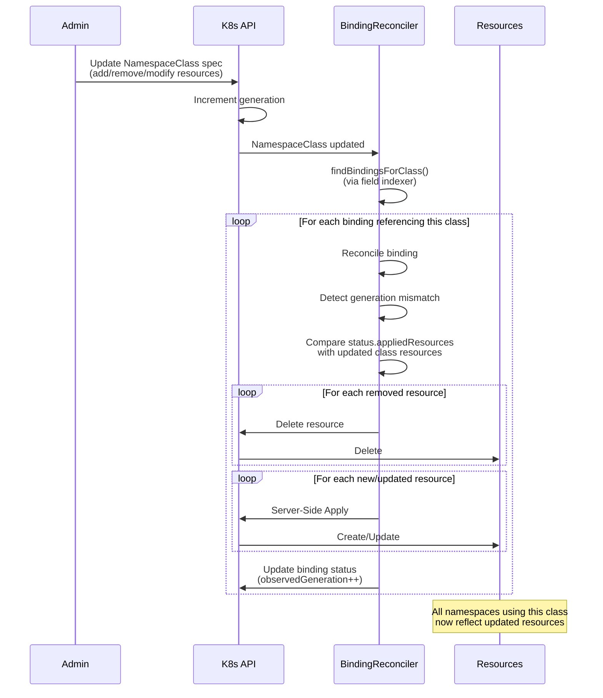
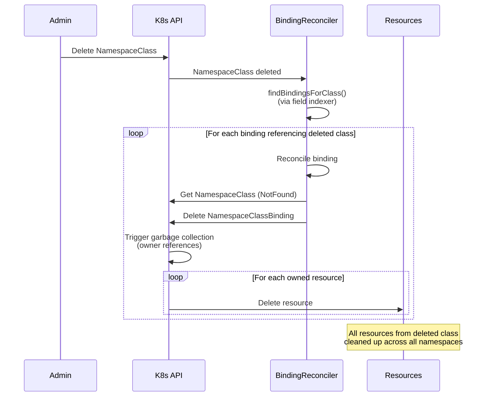

# NamespaceClass Operator - Controller Flow Diagrams

This document illustrates how the NamespaceClass operator controllers work together to implement each user story.

## Architecture Overview

The operator uses a **two-tier reconciliation** pattern:

1. **NamespaceReconciler** - Watches namespaces and manages NamespaceClassBinding lifecycle
2. **NamespaceClassBindingReconciler** - Watches bindings and NamespaceClasses, manages actual resources

This separation creates a clean boundary between "what class should apply" (namespace controller) and "what resources to create" (binding controller).

---

## 1. Define a NamespaceClass

**Story**: Admin defines a NamespaceClass CRD with a list of namespace-scoped resources.



**Key Points**:
- NamespaceClass is a cluster-scoped configuration resource
- No controller reconciliation needed - it's just stored for later use
- Can be referenced by multiple namespaces

---

## 2. Apply NamespaceClass to a Namespace

**Story**: Namespace with label `namespaceclass.akuity.io/name=<class>` gets all resources from that class created inside it.



**Key Points**:
- NamespaceReconciler creates the binding (one per namespace)
- BindingReconciler does the actual resource creation
- Server-Side Apply ensures idempotency
- Owner references: Namespace → Binding → Resources (for automatic cleanup)

---

## 3. Remove NamespaceClass Label from Namespace

**Story**: When label is removed, all resources created from the NamespaceClass are deleted.



**Key Points**:
- Only the binding is explicitly deleted
- Kubernetes garbage collector handles cascading deletion via owner references
- No manual cleanup logic needed - elegant and robust

---

## 4. Switch Namespace to Different NamespaceClass

**Story**: Label changes from one class to another - old resources removed, new resources created.



**Key Points**:
- Binding is updated (not recreated) for smooth transition
- Pruning logic compares old vs new resource lists
- Server-Side Apply handles overlapping resources gracefully
- Status tracks which class is currently applied

---

## 5. Update an Existing NamespaceClass

**Story**: NamespaceClass spec is updated - all namespaces referencing it are reconciled to match.



**Key Points**:
- Watch on NamespaceClass triggers reconciliation of all bindings
- Field indexer (`spec.className`) enables efficient binding lookup
- Generation tracking prevents redundant reconciliations
- Each namespace is updated independently (fan-out pattern)

---

## 6. Remove an Existing NamespaceClass

**Story**: NamespaceClass is deleted - all resources are removed from all namespaces using it.



**Key Points**:
- BindingReconciler detects class deletion (NotFound error)
- Deleting binding triggers cascading deletion of all owned resources
- Cleanup happens automatically via owner references
- Safe and clean - no orphaned resources

---

## Key Design Patterns

### 1. Two-Tier Reconciliation
- **NamespaceReconciler**: Manages binding lifecycle based on namespace labels
- **BindingReconciler**: Manages actual resources based on NamespaceClass definitions
- Clean separation of concerns

### 2. Owner References
- `Namespace` owns `NamespaceClassBinding`
- `NamespaceClassBinding` owns all created resources
- Automatic garbage collection when owner is deleted
- Prevents orphaned resources

### 3. Server-Side Apply (SSA)
- Idempotent resource creation/updates
- Field-level conflict resolution
- `ForceOwnership` allows taking over fields from other controllers
- No need for complex Update vs Create logic

### 4. Field Indexing
- Index bindings by `spec.className`
- Enables efficient lookup: "which bindings use this class?"
- O(1) lookup instead of O(n) list filtering
- Critical for NamespaceClass update/delete fan-out

### 5. Generation Tracking
- Kubernetes increments `generation` on spec changes
- Controller tracks `status.observedGeneration`
- Reconcile only when `generation != observedGeneration`
- Avoids unnecessary API calls and resource churn

### 6. Declarative Pruning
- Track applied resources in `status.appliedResources`
- Compare with desired resources from NamespaceClass
- Delete resources no longer in desired state
- Add/update resources in desired state
- Simple set-based diff logic

### 7. Event-Driven Architecture
- Controllers react to resource changes (watches)
- No polling required
- Efficient and scalable
- Eventually consistent

---

## Implementation Details

### NamespaceReconciler
- **Watches**: `Namespace` resources
- **Predicate**: Only reconcile when `namespaceclass.akuity.io/name` label changes
- **Actions**: Create/Update/Delete `NamespaceClassBinding` to match label

### BindingReconciler
- **Watches**: `NamespaceClassBinding` (primary), `NamespaceClass` (secondary)
- **Index**: `spec.className` for efficient class-to-bindings lookup
- **Actions**:
  - Fetch referenced NamespaceClass
  - Prune stale resources
  - Apply current resources via SSA
  - Update status with observed generation and applied resources

### Status Tracking
```yaml
status:
  observedClassName: "production"      # Which class is applied
  observedClassGeneration: 5           # Which version of the class
  appliedResources:                    # What resources exist
    - apiVersion: v1
      kind: ConfigMap
      name: app-config
    - apiVersion: v1
      kind: Secret
      name: app-secret
```

This status enables:
- Idempotent reconciliation (skip if generation matches)
- Accurate pruning (delete resources not in current class)
- Observability (see what the controller has done)

---

## Testing Coverage

All flows are validated by e2e tests:

| Flow | Test |
|------|------|
| Define NamespaceClass | `TestDefineNamespaceClass` |
| Apply to Namespace | `TestApplyNamespaceClassToNamespace` |
| Remove Label | `TestRemoveNamespaceClassLabel` |
| Switch Class | `TestSwitchNamespaceClass` |
| Update Class | `TestUpdateNamespaceClass` |
| Remove Class | `TestRemoveNamespaceClass` |

Plus advanced scenarios:
- `TestPruningResourceRemoval` - Resource removal from class
- `TestFieldUpdateReconciliation` - Field-level updates
- `TestOverDeletionGuard` - Only delete owned resources
- `TestProvenanceMarkers` - Owner reference validation
- `TestIdempotency` - Repeated reconciliation safety
